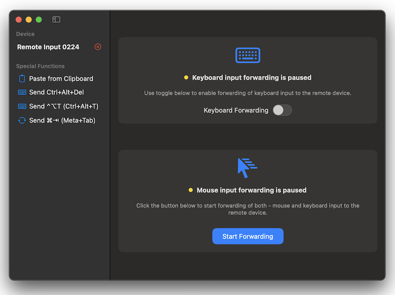
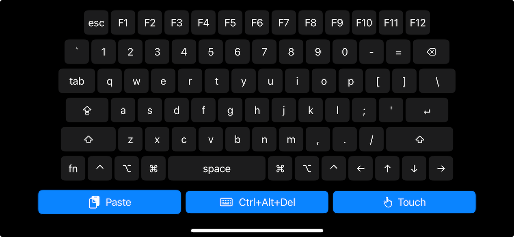

# Remote Input App

A macOS and iOS application that allows you to control other devices using your Mac's keyboard and mouse/trackpad. 

Remote Input App works by capturing your Mac's keyboard and mouse input, then wirelessly transmitting it to a small USB dongle that acts as a virtual keyboard and mouse. The dongle connects to any device with a USB port, allowing you to control it as if you were using a physical keyboard and mouse directly connected to that device. 

## Typical Usecases

- Do initial setup of Raspberry Pi or similar SBCs
- Access device that are not connected to the network
- Control smart TV

## Required Hardware

The Remote Input Dongle [firmware](https://github.com/mradugin/remote-input-dongle) was initially written for the ESP32-S3 SoC using PlatformIO and the Arduino framework, making it easily portable to other SoCs with the required peripherals - USB, BLE.

I use the [ESP32-S3-Zero](https://www.waveshare.com/wiki/ESP32-S3-Zero) with a 3D-printed [enclosure](https://www.thingiverse.com/thing:7041421).

## Getting Started

### Prerequisites

- macOS 13.0+ or iOS 16.0+
- Bluetooth enabled on your device
- Remote Input Dongle (ESP32-S3 based)
- Target device with USB port

### Building from Source

```bash
git clone https://github.com/mradugin/remote-input-app.git
cd remote-input-app
open RemoteInput.xcodeproj
```

In Xcode:
- Select your target device (macOS or iOS)
- Press `Cmd+R` to build and run

### Flashing Firmware

Follow instructions in [Remote Input Dongle](https://github.com/mradugin/remote-input-dongle) repository. 

### Pairing for the First Time

**Note:** During pairing, the dongle will output the pairing security pin as if it was typed on the keyboard, so it is advised to have a text entry field visible. After pairing (successful or not), the dongle will delete the pin by emulating backspace key presses.

1. Insert the dongle into the target device (PC, Mac, SBC, etc).

2. After power-up, the dongle will enter advertising mode (status LED blinking blue).

3. Run the app on your Mac, start scanning for devices, and the device should appear in the discovered device list.

4. Press the connect button (>) next to the discovered device, and the device will enter pairing mode. Your Mac will show a pairing dialog with a security pin, and the same pin will be displayed on the target device the dongle is attached to (status LED blinking yellow). If both pins match, press confirm on your Mac and press the BOOT button on the dongle.
   
   **Note:** If pairing is not confirmed on the dongle within 30 seconds, it will abort the current pairing session and return to advertising mode.

5. If pairing was successful and a secure connection is established, the dongle will enter operational mode (status LED solid blue).

## How to Use the Application

### macOS Application



#### Using Keyboard and Mouse Forwarding

**Keyboard Forwarding:**
1. Toggle "Keyboard Forwarding" switch to enable
2. All keyboard input will be forwarded to the target device
3. Toggle off to disable forwarding

**Mouse Forwarding:**
1. Click "Start Forwarding" to enable both keyboard and mouse forwarding
2. The mouse will be trapped in the application window, and the cursor hidden
3. All mouse movements and clicks will be forwarded to the target device
4. All keyboard input will be forwarded to the target device
5. Press `Ctrl+Option+T` to exit forwarding mode

**Note:** Even if keyboard or mouse forwarding is enabled, you can switch to other applications using `Cmd+Tab`, no mouse or keyboard input will be forwarded when Remote Input App is not focused.

On the dongle when keyboard event is receveid status LED will blink red, on mouse event - blink green.

#### Special Functions

The sidebar provides quick access to common operations:

- **Paste from Clipboard:** Sends clipboard content to the target device
- **Send Ctrl+Alt+Del:** Sends the Ctrl+Alt+Del combination
- **Send Ctrl+Alt+T:** Sends Ctrl+Alt+T (useful for terminal)
- **Send Meta+Tab:** Sends Command+Tab (application switcher)

### iOS Application



#### Usage

The iOS app provides a simplified interface with:

- **Automatic Connection:** Automatically connects to the first discovered Remote Input dongle
- **Input Mode Switching:** Quick access buttons to switch between keyboard and touch input modes
- **Special Functions:** Paste and Ctrl+Alt+Del buttons for common operations

### Other Features

#### Queue Management

- The application queues key and mouse events to maintain sequence of events 
- Queue status is shown when there are 10+ pending events
- Use the trash button to clear the queue if needed
