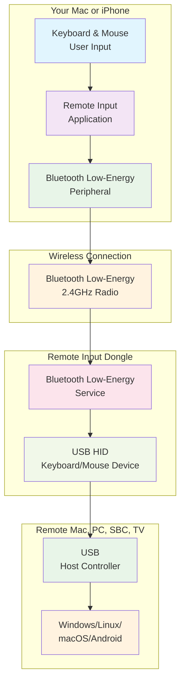

## Architecture Diagram

```mermaid
graph TB
    subgraph "Your Mac or iPhone"
        A[Keyboard & Mouse<br/>User Input]
        B[Remote Input<br/>Application]
        C[Bluetooth Low-Energy<br/>Peripheral]
    end
    
    subgraph "Wireless Connection"
        D[Bluetooth Low-Energy<br/>2.4GHz Radio]
    end
    
    subgraph "Remote Input Dongle"
        E[Bluetooth Low-Energy<br/>Service]
        F[USB HID<br/>Keyboard/Mouse Device]
    end
    
    subgraph "Remote Mac, PC, SBC, TV"
        G[USB<br/>Host Controller]
        H[Windows/Linux/<br/>macOS/Android]
    end
    
    A --> B
    B --> C
    C --> D
    D --> E
    E --> F
    F --> G
    G --> H
    
    style A fill:#e1f5fe
    style B fill:#f3e5f5
    style C fill:#e8f5e8
    style D fill:#fff3e0
    style E fill:#fce4ec
    style F fill:#f1f8e9
    style G fill:#e8f5e8
    style H fill:#fff3e0
```
